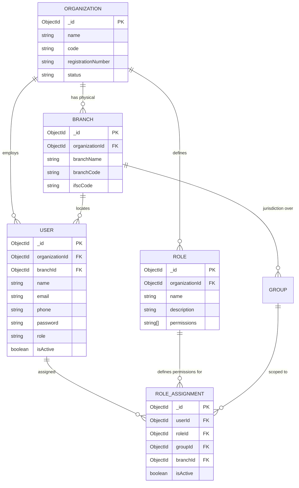
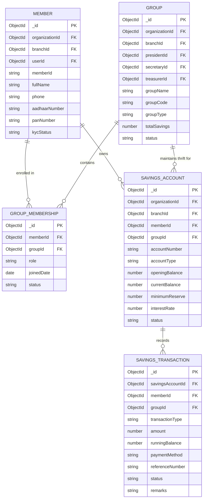
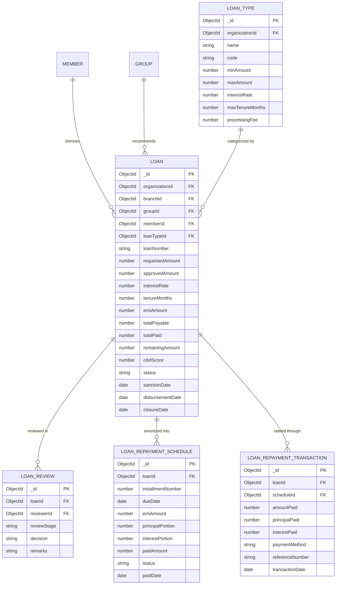
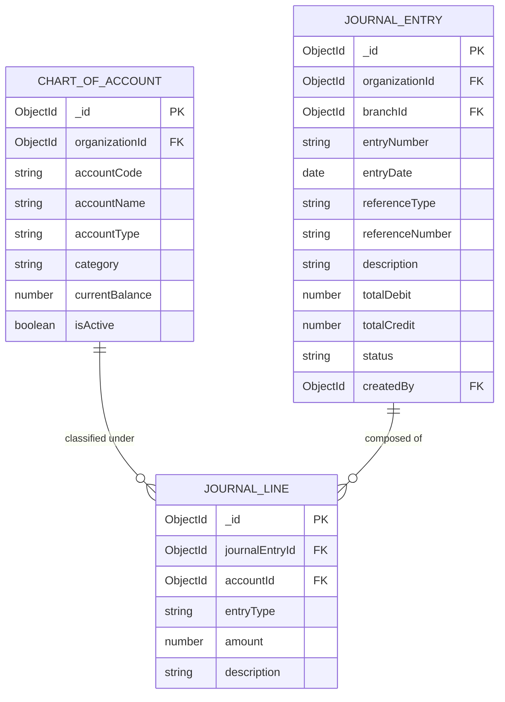

# SAHAKARA ERP — Database Schema & Architecture Guide

**Complete Database Architecture, Entity-Relationship Models & Data Dictionary**  
**Document Version:** `v1.0.0 (Production Master)`  
**Database Engine:** `MongoDB v7.0+` with `Mongoose v8.1.1 ODM`  

---

## 1. Database Architectural Principles

Sahakara ERP employs a **Normalized-Embedded Hybrid Data Model** optimized for high-throughput cooperative banking and multi-tenant isolation:

1. **Hierarchical Multi-Tenancy Scoping**:
   - Every operational entity carries foreign key references: `organizationId` (Society level), `branchId` (Regional branch), and where applicable `groupId` (SHG / JLG level).
   - Compound indexes on `{ organizationId: 1, branchId: 1, groupId: 1 }` guarantee fast query execution and data isolation.
2. **Immutable Financial Journal Entries**:
   - Savings transactions (`SavingsTransaction`) and double-entry accounting records (`JournalEntry`, `JournalLine`) are append-only.
   - Corrections require reversing journal entries rather than destructive updates.
3. **Optimistic Locking & Decimal Precision**:
   - Financial balances use JavaScript Numbers stored with two decimal places of precision (`en-IN` format).
   - Deposit and withdrawal workflows validate sufficient balance and reserve buffers before committing updates.
4. **Comprehensive Audit Logs**:
   - State-altering operations log full actor details, IP address, changed fields, and timestamps in the `AuditLog` collection.

---

## 2. Entity-Relationship Diagrams (ERDs)

### A. Multi-Tenant Governance & User RBAC ERD

---

### B. Member Registry, SHG Federation & Savings Passbook ERD

---

### C. Credit Sanction, Loan Lifecycle & EMI Amortization ERD

---

### D. Double-Entry Accounting & General Ledger ERD

---

## 3. Comprehensive Data Dictionary (All Models)

### 1. `Organization` (`organizations`)
| Field Name | Type | Constraints | Description |
| :--- | :--- | :--- | :--- |
| `_id` | `ObjectId` | Primary Key | Unique Society identifier. |
| `name` | `String` | Required, Trim | Registered name of the cooperative society. |
| `code` | `String` | Required, Unique, Uppercase | Unique alphanumeric society code (e.g. `KUCS`). |
| `registrationNumber` | `String` | Required, Unique | Official registration number under Cooperative Act. |
| `state` | `String` | Default: `'Kerala'` | State of incorporation. |
| `district` | `String` | Required | District of primary jurisdiction. |
| `status` | `String` | Enum: `Pending`, `Active`, `Suspended` | Operational state. |
| `createdAt` / `updatedAt` | `Date` | Automated timestamps | Record lifecycle stamps. |

---

### 2. `Branch` (`branches`)
| Field Name | Type | Constraints | Description |
| :--- | :--- | :--- | :--- |
| `_id` | `ObjectId` | Primary Key | Unique branch identifier. |
| `organizationId` | `ObjectId` | Required, Ref: `Organization` | Parent cooperative society. |
| `branchName` | `String` | Required, Trim | Name of physical branch (e.g. `Kottayam Main Branch`). |
| `branchCode` | `String` | Required, Unique | Alphanumeric branch code (e.g. `BR-KTM-01`). |
| `ifscCode` | `String` | Uppercase, Trim | IFSC or society clearance code. |
| `managerId` | `ObjectId` | Ref: `User` | Assigned Branch Manager. |
| `status` | `String` | Enum: `Active`, `Inactive` | Branch operational status. |

---

### 3. `User` (`users`)
| Field Name | Type | Constraints | Description |
| :--- | :--- | :--- | :--- |
| `_id` | `ObjectId` | Primary Key | User account ID. |
| `organizationId` | `ObjectId` | Ref: `Organization` | Affiliated society. |
| `branchId` | `ObjectId` | Ref: `Branch` | Affiliated physical branch. |
| `name` | `String` | Required, Trim | Full name of the user. |
| `email` | `String` | Required, Unique, Lowercase | User email login credential. |
| `phone` | `String` | Required, Unique, Trim | Mobile phone number. |
| `password` | `String` | Required | Bcrypt-hashed password. |
| `role` | `String` | Enum: `Super Admin`, `Organization Admin`, `Branch Manager`, `President`, `Secretary`, `Treasurer`, `Employee`, `Member` | Primary global/default role. |
| `isActive` | `Boolean` | Default: `true` | Account active flag. |

---

### 4. `Member` (`members`)
| Field Name | Type | Constraints | Description |
| :--- | :--- | :--- | :--- |
| `_id` | `ObjectId` | Primary Key | Member record ID. |
| `organizationId` | `ObjectId` | Required, Ref: `Organization` | Affiliated society. |
| `branchId` | `ObjectId` | Required, Ref: `Branch` | Affiliated branch. |
| `userId` | `ObjectId` | Ref: `User` | Linked portal login account. |
| `memberId` | `String` | Required, Unique | Formal member ID (e.g. `MEM-2026-KU001`). |
| `fullName` | `String` | Required, Trim | Full legal name. |
| `gender` | `String` | Enum: `Male`, `Female`, `Other` | Gender classification. |
| `dob` | `Date` | Required | Date of birth. |
| `phone` | `String` | Required, Unique | Contact mobile number. |
| `aadhaarNumber` | `String` | Unique, Trim | 12-digit Aadhaar UIDAI number. |
| `panNumber` | `String` | Uppercase, Trim | Income tax PAN card number. |
| `kycStatus` | `String` | Enum: `Pending`, `Under Review`, `Verified`, `Rejected` | Identity verification state. |

---

### 5. `Group` (`groups`)
| Field Name | Type | Constraints | Description |
| :--- | :--- | :--- | :--- |
| `_id` | `ObjectId` | Primary Key | Group identifier. |
| `organizationId` | `ObjectId` | Required, Ref: `Organization` | Parent society. |
| `branchId` | `ObjectId` | Required, Ref: `Branch` | Parent branch. |
| `groupName` | `String` | Required, Trim | Name (e.g. `Kottayam Micro-Enterprise Group`). |
| `groupCode` | `String` | Required, Unique | Code (e.g. `MEG-KTM-03`). |
| `groupType` | `String` | Enum: `SHG`, `JLG`, `Micro-Enterprise`, `Kudumbashree` | Functional cooperative category. |
| `presidentId` | `ObjectId` | Ref: `Member` | Elected Group President. |
| `secretaryId` | `ObjectId` | Ref: `Member` | Elected Group Secretary. |
| `treasurerId` | `ObjectId` | Ref: `Member` | Elected Group Treasurer. |
| `meetingFrequency` | `String` | Enum: `Weekly`, `Bi-Weekly`, `Monthly` | Scheduled meeting cycle. |
| `minimumSavings` | `Number` | Default: `500` | Mandatory monthly thrift contribution amount. |
| `totalSavings` | `Number` | Default: `0` | Aggregate thrift pool accumulated by all members. |

---

### 6. `SavingsAccount` (`savingsaccounts`)
| Field Name | Type | Constraints | Description |
| :--- | :--- | :--- | :--- |
| `_id` | `ObjectId` | Primary Key | Savings account ID. |
| `organizationId` | `ObjectId` | Required, Ref: `Organization` | Parent society. |
| `branchId` | `ObjectId` | Required, Ref: `Branch` | Parent branch. |
| `memberId` | `ObjectId` | Required, Ref: `Member` | Beneficiary member. |
| `groupId` | `ObjectId` | Required, Ref: `Group` | Specific SHG unit maintaining the account. |
| `accountNumber` | `String` | Required, Unique | Account folio number (e.g. `SAV-MEG-KTM-03-MEM-2026-KU001-0018`). |
| `accountType` | `String` | Default: `'Regular Savings'` | Thrift or term deposit category. |
| `currentBalance` | `Number` | Required, Default: `0` | Total ledger balance in rupees. |
| `minimumReserve` | `Number` | Default: `500` | Statutory non-withdrawable reserve buffer. |
| `interestRate` | `Number` | Default: `4.5` | Annual compounded interest percentage. |
| `status` | `String` | Enum: `Active`, `Dormant`, `Frozen`, `Closed` | Account operational state. |

---

### 7. `SavingsTransaction` (`savingstransactions`)
| Field Name | Type | Constraints | Description |
| :--- | :--- | :--- | :--- |
| `_id` | `ObjectId` | Primary Key | Transaction entry ID. |
| `savingsAccountId`| `ObjectId` | Required, Ref: `SavingsAccount` | Target savings account. |
| `memberId` | `ObjectId` | Required, Ref: `Member` | Member initiating transaction. |
| `groupId` | `ObjectId` | Required, Ref: `Group` | SHG group context. |
| `transactionType` | `String` | Enum: `Deposit`, `Withdrawal`, `Interest`, `Penalty` | Ledger entry direction. |
| `amount` | `Number` | Required, Min: `1` | Transaction amount in rupees. |
| `runningBalance` | `Number` | Required | Post-transaction ledger balance. |
| `paymentMethod` | `String` | Enum: `Cash`, `UPI`, `Bank Transfer`, `Savings Auto-Debit` | Payment channel. |
| `referenceNumber` | `String` | Trim | Payment gateway / UPI transaction reference. |
| `status` | `String` | Enum: `Pending`, `Approved`, `Rejected`, `Completed` | Approval and settlement state. |

---

### 8. `Loan` (`loans`)
| Field Name | Type | Constraints | Description |
| :--- | :--- | :--- | :--- |
| `_id` | `ObjectId` | Primary Key | Loan record ID. |
| `organizationId` | `ObjectId` | Required, Ref: `Organization` | Parent society. |
| `branchId` | `ObjectId` | Required, Ref: `Branch` | Parent branch. |
| `groupId` | `ObjectId` | Required, Ref: `Group` | SHG under which the loan is issued. |
| `memberId` | `ObjectId` | Required, Ref: `Member` | Borrower. |
| `loanTypeId` | `ObjectId` | Required, Ref: `LoanType` | Configured loan product. |
| `loanNumber` | `String` | Required, Unique | Loan sanction number (e.g. `LN-2026-0042`). |
| `requestedAmount` | `Number` | Required | Principal requested by applicant. |
| `approvedAmount` | `Number` | Default: `0` | Principal sanctioned by Branch Manager. |
| `interestRate` | `Number` | Required | Annual reducing interest percentage. |
| `tenureMonths` | `Number` | Required | Total repayment term in months. |
| `emiAmount` | `Number` | Default: `0` | Calculated monthly installment. |
| `totalPayable` | `Number` | Default: `0` | Total principal + interest obligation. |
| `totalPaid` | `Number` | Default: `0` | Cumulative amount repaid by borrower. |
| `remainingAmount` | `Number` | Default: `0` | Outstanding balance left to settle. |
| `cibilScore` | `Number` | Range: `300 - 900` | Calculated credit score. |
| `status` | `String` | Enum: `Pending`, `Recommended`, `Approved`, `Active`, `Closed`, `Rejected`, `Defaulted` | Loan lifecycle state. |
| `sanctionDate` | `Date` | Optional | Date approved by Credit Committee. |
| `disbursementDate`| `Date` | Optional | Date funds released. |
| `closureDate` | `Date` | Optional | Date loan fully settled and marked Closed. |

---

### 9. `LoanRepaymentSchedule` (`loanrepaymentschedules`)
| Field Name | Type | Constraints | Description |
| :--- | :--- | :--- | :--- |
| `_id` | `ObjectId` | Primary Key | Schedule row ID. |
| `loanId` | `ObjectId` | Required, Ref: `Loan` | Parent loan account. |
| `installmentNumber`| `Number` | Required | Installment sequence (e.g. Month 1, 2... 12). |
| `dueDate` | `Date` | Required | Calendar due date for payment. |
| `emiAmount` | `Number` | Required | Total installment due. |
| `principalPortion`| `Number` | Required | Principal deduction component. |
| `interestPortion` | `Number` | Required | Interest revenue component. |
| `paidAmount` | `Number` | Default: `0` | Amount paid towards installment. |
| `status` | `String` | Enum: `Unpaid`, `Partially Paid`, `Paid`, `Overdue` | Installment payment status. |
| `paidDate` | `Date` | Optional | Date settled. |

---

### 10. `ChartOfAccount` (`chartofaccounts`)
| Field Name | Type | Constraints | Description |
| :--- | :--- | :--- | :--- |
| `_id` | `ObjectId` | Primary Key | Ledger account head ID. |
| `organizationId` | `ObjectId` | Required, Ref: `Organization` | Parent society. |
| `accountCode` | `String` | Required, Unique | Numeric account code (e.g. `1010`, `2010`). |
| `accountName` | `String` | Required, Trim | Name (e.g. `Cash on Hand`, `Thrift Savings Liability`). |
| `accountType` | `String` | Enum: `Asset`, `Liability`, `Equity`, `Revenue`, `Expense` | Major accounting classification. |
| `currentBalance` | `Number` | Default: `0` | Running balance in rupees. |
| `isActive` | `Boolean` | Default: `true` | Account active flag. |

---

### 11. `JournalEntry` & `JournalLine` (`journalentries`, `journallines`)
| Field Name | Type | Constraints | Description |
| :--- | :--- | :--- | :--- |
| `_id` | `ObjectId` | Primary Key | Journal voucher ID. |
| `organizationId` | `ObjectId` | Required, Ref: `Organization` | Parent society. |
| `branchId` | `ObjectId` | Required, Ref: `Branch` | Associated branch. |
| `entryNumber` | `String` | Required, Unique | Journal voucher number (e.g. `JV-2026-0012`). |
| `entryDate` | `Date` | Required | Posting date. |
| `totalDebit` | `Number` | Required | Sum of all debit lines. |
| `totalCredit` | `Number` | Required | Sum of all credit lines (Must equal `totalDebit`). |
| `lines` | `Array` | Ref: `JournalLine` | Array of sub-ledger debit/credit lines. |

---

### 12. `Meeting` & Sub-Collections (`meetings`)
| Field Name | Type | Constraints | Description |
| :--- | :--- | :--- | :--- |
| `_id` | `ObjectId` | Primary Key | Meeting record ID. |
| `organizationId` | `ObjectId` | Required, Ref: `Organization` | Parent society. |
| `branchId` | `ObjectId` | Required, Ref: `Branch` | Parent branch. |
| `groupId` | `ObjectId` | Required, Ref: `Group` | Convening SHG unit. |
| `title` | `String` | Required, Trim | Meeting agenda title. |
| `meetingDate` | `Date` | Required | Date and time. |
| `venue` | `String` | Trim | Physical location or virtual link. |
| `quorumMet` | `Boolean` | Default: `false` | True if ≥ 50% members attended. |
| `status` | `String` | Enum: `Scheduled`, `In-Progress`, `Completed`, `Cancelled` | Meeting progress state. |

---

### 13. `Complaint` (`complaints`)
| Field Name | Type | Constraints | Description |
| :--- | :--- | :--- | :--- |
| `_id` | `ObjectId` | Primary Key | Grievance ticket ID. |
| `organizationId` | `ObjectId` | Required, Ref: `Organization` | Parent society. |
| `branchId` | `ObjectId` | Required, Ref: `Branch` | Parent branch. |
| `groupId` | `ObjectId` | Ref: `Group` | Associated SHG. |
| `memberId` | `ObjectId` | Required, Ref: `Member` | Complainant. |
| `category` | `String` | Enum: `Loan`, `Savings`, `Meeting`, `Governance`, `Other` | Ticket domain. |
| `priority` | `String` | Enum: `Low`, `Medium`, `High`, `Urgent` | Urgency tier. |
| `addressedTo` | `String` | Enum: `President`, `Branch Manager`, `Organization Admin` | Current handling authority. |
| `status` | `String` | Enum: `Open`, `In-Progress`, `Resolved`, `Escalated` | Ticket lifecycle state. |
| `resolutionNotes` | `String` | Trim | Official resolution comments. |

---

### 14. `AuditLog` (`auditlogs`)
| Field Name | Type | Constraints | Description |
| :--- | :--- | :--- | :--- |
| `_id` | `ObjectId` | Primary Key | Audit entry ID. |
| `organizationId` | `ObjectId` | Ref: `Organization` | Society context. |
| `userId` | `ObjectId` | Ref: `User` | Actor user ID. |
| `performerName` | `String` | Trim | Name of user at time of action. |
| `performerRole` | `String` | Trim | Role exercised during action. |
| `action` | `String` | Required | Performed action verb (e.g. `LOAN_DISBURSEMENT`). |
| `module` | `String` | Required | Domain module (e.g. `LOANS`, `SAVINGS`). |
| `ipAddress` | `String` | Trim | Client IP address. |
| `timestamp` | `Date` | Default: `Date.now` | Immutable timestamp. |
